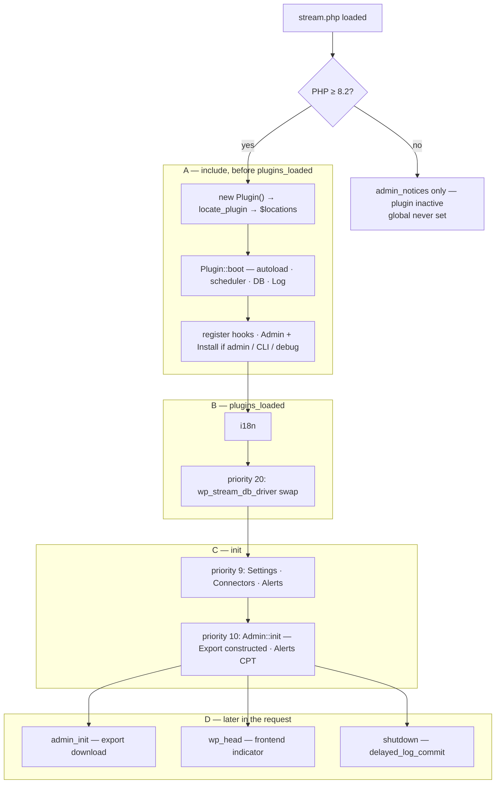

# Stream architecture

Describes Stream 5.0.0 (`Plugin::VERSION`). Read top to bottom. Every class link is repo-relative.

Related: [contributing.md](contributing.md) (env + commands) · [connectors.md](connectors.md) (generated inventory) · [docs/adding-a-connector.md](docs/adding-a-connector.md) (how to add a connector) · [changelog.md](changelog.md)

Not covered here: writing an alert type · hook reference · Abilities/MCP internals · scheduler internals · admin UI / settings internals.

## Boot sequence

WordPress loads [stream.php](stream.php) before `plugins_loaded`. Connectors, alerts, and settings are **not** built then — they are constructed on `init` priority 9. Scan the diagram; the table is the same sequence with file links.

| # | Phase | When | What runs | File |
|---|-------|------|-----------|------|
| 1 | A | plugin file include | `ABSPATH` guard; define `WP_STREAM_SETTINGS_CAPABILITY` (`manage_options`), `WP_STREAM_MIN_PHP_VERSION` (`8.2`) | [stream.php](stream.php) |
| 2 | A | | PHP gate: too old → hook `wp_stream_fail_php_version` on `admin_notices` / `network_admin_notices` and stop (global unset); else `require` [classes/class-plugin.php](classes/class-plugin.php) and `$GLOBALS['wp_stream'] = new Plugin()` | [stream.php](stream.php) |
| 3 | A | `Plugin::__construct()` | `locate_plugin()` → `$locations` (`plugin`, `dir`, `url`, `inc_dir`, `class_dir`) | [classes/class-plugin.php](classes/class-plugin.php) |
| 4 | A | `Plugin::boot()` | `spl_autoload_register` (classes under `classes/` only) | |
| 5 | A | | `create_scheduler()` — filter `wp_stream_use_action_scheduler`; [AS_Scheduler](classes/class-as-scheduler.php) (bundled Action Scheduler) or [Cron_Scheduler](classes/class-cron-scheduler.php) | [classes/class-scheduler.php](classes/class-scheduler.php) |
| 6 | A | | `require` [includes/functions.php](includes/functions.php) | |
| 7 | A | | `wp_stream_db_driver` → `new DB( $driver )`; `wp_die` if the class is missing or not a `DB_Driver` | [classes/class-db.php](classes/class-db.php), [classes/class-db-driver.php](classes/class-db-driver.php), [classes/class-db-driver-wpdb.php](classes/class-db-driver-wpdb.php) |
| 8 | A | | `wp_stream_log_handler` → `$log`; client IP captured | [classes/class-log.php](classes/class-log.php) |
| 9 | A | | hooks registered: `plugins_loaded`→`i18n`; `init`@9→`init`; `wp_head`→`frontend_indicator`; `plugins_loaded`@20→`plugins_loaded` | |
| 10 | A | | if admin / `WP_CLI` / `WP_STREAM_DEV_DEBUG`: `new Admin()` (Menu, Assets, Screen_Records, Screen_Settings, Purge, Ajax) and `$install = $driver->setup_storage()`; elseif `DOING_CRON`: `Admin` only; WP-CLI also registers `stream` | [classes/class-admin.php](classes/class-admin.php), [classes/class-install.php](classes/class-install.php), [classes/class-cli.php](classes/class-cli.php) |
| 11 | B | `plugins_loaded` | `i18n()` textdomain | |
| 12 | B | `plugins_loaded`@20 | `wp_stream_db_driver` re-applied; `$db` rebuilt for late add-ons | |
| 13 | C | `init`@9 | `Plugin::init()`: [Settings](classes/class-settings.php), [Connectors](classes/class-connectors.php) (loads + registers connectors now), [Alerts](classes/class-alerts.php) (engine, admin UI, types, triggers), [Alerts_List](classes/class-alerts-list.php), [Abilities](classes/class-abilities.php), [User_Picker](classes/class-user-picker.php) | |
| 14 | C | `init`@10 | `Admin::init()`: [Network](classes/class-network.php), [Live_Update](classes/class-live-update.php), [Export](classes/class-export.php); `Alerts::register_post_type()` | |
| 15 | D | later | `admin_init` → export download (only `page=wp_stream`); `wp_head` → frontend indicator; `shutdown` → `delayed_log_commit` | |

**Filters that must be registered before Stream’s plugin file loads** (mu-plugin, `wp-config.php`, or an earlier plugin). Too late on `plugins_loaded`:

| Filter | Applied in | Default |
|--------|------------|---------|
| `wp_stream_use_action_scheduler` | `create_scheduler()` during `boot()` | true if the bundled Action Scheduler file exists |
| `wp_stream_db_driver` | `boot()` (first pass) | `DB_Driver_WPDB` |
| `wp_stream_log_handler` | `boot()` | `new Log( $this )` |

`wp_stream_db_driver` is applied again at `plugins_loaded`@20.

**Scheduler (boot one-liner):** `AS_Scheduler` vs `Cron_Scheduler` — [classes/class-scheduler.php](classes/class-scheduler.php), [classes/class-as-scheduler.php](classes/class-as-scheduler.php), [classes/class-cron-scheduler.php](classes/class-cron-scheduler.php); bundled library `vendor/woocommerce/action-scheduler/action-scheduler.php`.

**Abilities (boot one-liner):** constructed in `Plugin::init()`; no-op unless WordPress 6.9+ (`WP_Ability`) and the Advanced setting is on. Stream does not load the MCP Adapter. See [classes/class-abilities.php](classes/class-abilities.php) and [contributing.md](contributing.md).

**Admin collaborators (one line):** constructed from `Admin`: `Admin_Menu`, `Admin_Assets`, `Admin_Screen_Records`, `Admin_Screen_Settings`, `Admin_Purge`, `Admin_Ajax`.

## Singleton and globals

`Plugin` is not a singleton (no static instance, no guard; `new Plugin()` twice would double-hook). `$GLOBALS['wp_stream']` is a process-wide service locator. `wp_stream_get_instance()` in [stream.php](stream.php) returns that global with **no** `isset` guard. On the PHP-gate path the global is never set.

| Property | Available from |
|----------|----------------|
| `locations`, `scheduler`, `db`, `log` | end of `boot()` (plugin include) |
| `admin`, `install` | same time, **only** admin / WP-CLI / `WP_STREAM_DEV_DEBUG` (`install`) and cron (`admin` only); otherwise `null` |
| `settings`, `connectors`, `alerts`, `alerts_list`, `abilities`, `user_picker` | `init` priority 9 |
| `admin->network`, `admin->live_update`, `admin->export` | `init` priority 10 |

| Request | `admin` | `install` | connectors registered | notes |
|---------|---------|-----------|-----------------------|-------|
| Front-end | no | no | those with `register_frontend` | `Log`/`DB` exist; no menus, no `dbDelta` |
| wp-admin / admin-ajax | yes | yes | those with `register_admin` | |
| WP-Cron | yes | no | `register_frontend` (`is_admin()` is false) | |
| WP-CLI | yes | yes | `register_frontend` (`is_admin()` is false) | `stream` command |
| REST | no | no | `register_frontend` | Abilities re-register caps when `admin` is null |

`register_connector_instances()` gates on `is_admin()` only — cron, CLI, and REST take the front-end branch.

Do not call `Log::log()` (it reads `$plugin->settings->options`) before `init`@9.

## Connector lifecycle

Files: [classes/class-connectors.php](classes/class-connectors.php), [classes/class-connector.php](classes/class-connector.php), [classes/class-log.php](classes/class-log.php), [classes/class-db.php](classes/class-db.php), [classes/class-db-driver-wpdb.php](classes/class-db-driver-wpdb.php).

1. **Registration.** `Connectors::__construct()` → `load_connectors()`: `get_available_connectors()` (include `connectors/class-connector-{slug}.php` for each `BUILTIN_CONNECTOR_SLUGS` entry) → `instantiate_connector_classes()` (keyed by `$instance->name`) → filter `wp_stream_connectors` (**instances**, not class names) → `register_connector_instances()` (dependency, `register_admin` / `register_frontend`, then `$connector->register()`). See [classes/class-connectors.php](classes/class-connectors.php) for remaining gates.
2. **Hook attachment.** `Connector::register()` adds `[ $this, 'callback' ]` at priority 10, 99 args, for each `$this->actions`.
3. **Event capture.** WP action → `callback()` → `callback_{sanitized_action}()` → `$this->log()` or `delayed_log()` (committed on `shutdown`).
4. **Record write.** `Connector::log()` → `wp_stream_log_data` (`false` aborts) → `Log::log()` → `wp_stream_is_record_excluded` → `DB::insert()` (bails on `WP_IMPORTING`) → `wp_stream_record_array` → `DB_Driver_WPDB::insert_record()` (`{prefix}stream` + `{prefix}stream_meta`) → `wp_stream_record_inserted`.

### Where would I look to add a new connector?

**In this plugin:** add the slug to `Connectors::BUILTIN_CONNECTOR_SLUGS` ([classes/class-connectors.php](classes/class-connectors.php)), create `connectors/class-connector-{slug}.php` with `class Connector_{Slug} extends Connector` ([classes/class-connector.php](classes/class-connector.php)); set `$name` and `$actions`, implement `get_label()`, `get_context_labels()`, `get_action_labels()`, and `callback_{action}()` methods that call `$this->log()`. Template: [connectors/class-connector-posts.php](connectors/class-connector-posts.php). Regenerate [connectors.md](connectors.md) with `npm run document:connectors`.

**From another plugin:** hook `wp_stream_connectors` and append a `Connector` **instance** keyed by its `$name`.

Step-by-step guide: [docs/adding-a-connector.md](docs/adding-a-connector.md).

## Alert lifecycle

Storage: CPT `wp_stream_alerts`; statuses `wp_stream_enabled` / `wp_stream_disabled`.

Configuration: types via `wp_stream_alert_types`. Defaults: `none`, `highlight`, `email`, `ifttt`, `slack`, `webhook` ([alerts/class-alert-type-webhook.php](alerts/class-alert-type-webhook.php)). IFTTT has `$creatable = false` — hidden from the new-alert UI; existing alerts still fire. [alerts/class-alert-type-menu-alert.php](alerts/class-alert-type-menu-alert.php) and [alerts/class-alert-type-die.php](alerts/class-alert-type-die.php) are on disk but not default-loaded (only via the filter).

Triggers: author, context, action via `wp_stream_alert_triggers`. Match is **AND** via `wp_stream_alert_trigger_check`.

Evaluation + dispatch is **synchronous** on each record insert (a `WP_Query` per insert): `wp_stream_record_inserted` → [Alerts_Trigger_Engine](classes/class-alerts-trigger-engine.php)::`check_records` → [Alert](classes/class-alert.php)::`check_record` → `send_alert` → [Alert_Type](classes/class-alert-type.php)::`alert()`.

Façade: [Alerts](classes/class-alerts.php) builds the trigger engine and [Alerts_Admin_UI](classes/class-alerts-admin-ui.php). To add a type: extend `Alert_Type`, add via `wp_stream_alert_types`. Full guide: XWPENG-62.

## Exporter lifecycle

[Export](classes/class-export.php) is constructed in `Admin::init()` (`init`@10). It **only activates** when `$_GET['page'] === 'wp_stream'`.

Trigger: `admin_init` → `render_download()`, gated by the view cap, a nonce, and `record-actions=export-{slug}`. Not AJAX, not CLI.

Data: the records list table ([classes/class-admin-screen-records.php](classes/class-admin-screen-records.php)) with pagination disabled; cap `wp_stream_export_limit` (default 10000).

Output: [Exporter](classes/class-exporter.php)::`output_file()` sends headers then `exit`s unless `WP_STREAM_TESTS`. “Streamed” here means a full-payload synchronous HTTP download, **not** chunked streaming.

Defaults CSV + JSON ([exporters/class-exporter-csv.php](exporters/class-exporter-csv.php), [exporters/class-exporter-json.php](exporters/class-exporter-json.php)); add more via `wp_stream_exporters`. Menu items via `wp_stream_record_actions_menu`.

## Test tiers

Pointer only. Commands live in [contributing.md § Scripts and Commands](contributing.md#scripts-and-commands).

| Tier | Needs | Config | Command |
|------|-------|--------|---------|
| Unit (no WP bootstrap) | PHP 8.2+ on host, or wp-env | [phpunit-unit.xml](phpunit-unit.xml), `tests/phpunit/unit/` | `composer test-unit`; `npm run test:php-unit` |
| Integration PHPUnit | wp-env | [phpunit.xml](phpunit.xml), [phpunit-multisite.xml](phpunit-multisite.xml), `tests/phpunit/` excluding unit | `npm run test` (both); `npm run test:php` / `test:php-multisite` |
| E2E | wp-env at `http://localhost:8888` | [playwright.config.js](playwright.config.js), `tests/e2e/` | `npm run test-e2e` |
