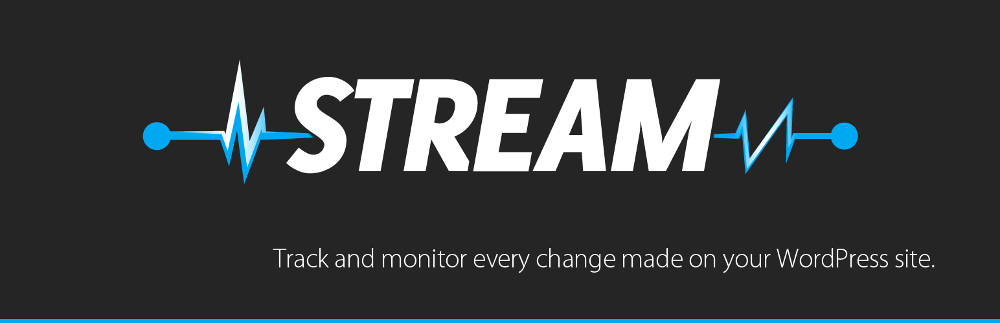
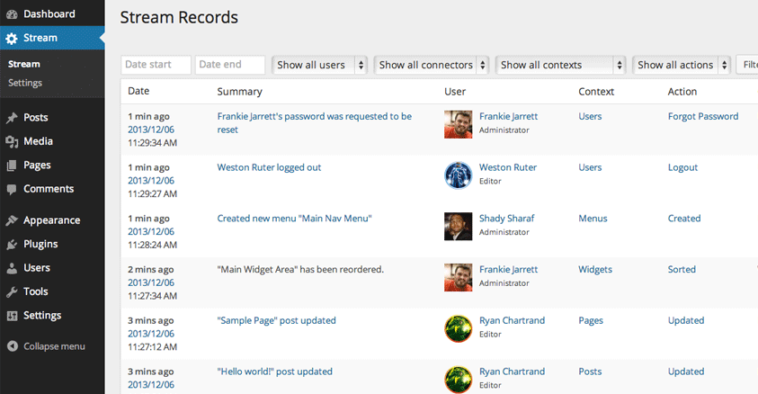
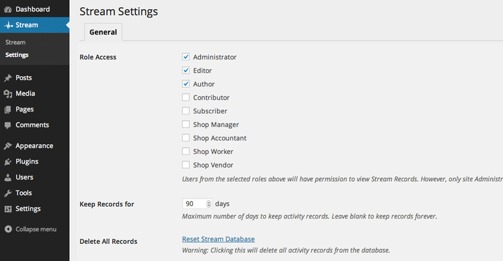
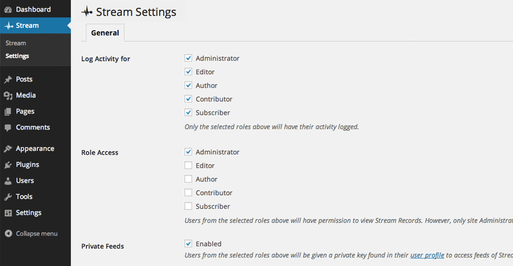
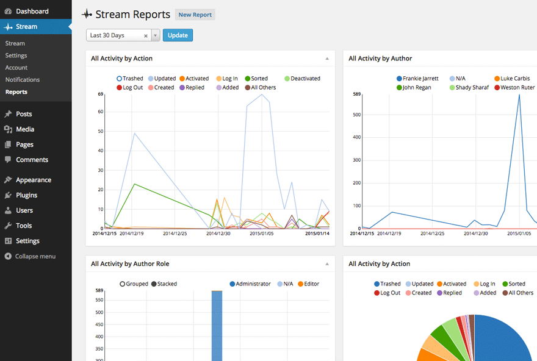

<!-- DO NOT EDIT THIS FILE; it is auto-generated from readme.txt -->
# Stream

Stream tracks logged-in user activity so you can monitor every change made on your WordPress site in beautifully organized detail.

**Contributors:** [x-team](http://profiles.wordpress.org/x-team), [shadyvb](http://profiles.wordpress.org/shadyvb), [fjarrett](http://profiles.wordpress.org/fjarrett), [jonathanbardo](http://profiles.wordpress.org/jonathanbardo), [johnregan3](http://profiles.wordpress.org/johnregan3), [akeda](http://profiles.wordpress.org/akeda), [kucrut](http://profiles.wordpress.org/kucrut), [topher1kenobe](http://profiles.wordpress.org/topher1kenobe), [powelski](http://profiles.wordpress.org/powelski)  
**Tags:** [actions](http://wordpress.org/plugins/tags/actions), [activity](http://wordpress.org/plugins/tags/activity), [admin](http://wordpress.org/plugins/tags/admin), [analytics](http://wordpress.org/plugins/tags/analytics), [dashboard](http://wordpress.org/plugins/tags/dashboard), [log](http://wordpress.org/plugins/tags/log), [notification](http://wordpress.org/plugins/tags/notification), [stream](http://wordpress.org/plugins/tags/stream), [users](http://wordpress.org/plugins/tags/users)  
**Requires at least:** 3.7  
**Tested up to:** 3.8.1  
**Stable tag:** trunk (master)  
**License:** [GPLv2 or later](http://www.gnu.org/licenses/gpl-2.0.html)  

## Description ##

**Note: This plugin requires PHP 5.3 or higher to be activated.**

Never be in the dark about WP Admin activity again. Stream allows you to know exactly when changes to your site have been made, and more importantly, who did them.

Every logged-in user action is logged in a user activity stream and organized for easy filtering by connector, context, action and IP address.

Built with performance in mind, Stream won't pollute your default posts table with records or slow down content querying on your site.

Stream is built to extend, allowing developers to easily build their own connectors to track any type of action in the activity stream (developer documentation coming soon).

**Recorded activity:**

 * Posts
 * Pages
 * Custom Post Types
 * Users
 * Themes
 * Plugins
 * Tags
 * Categories
 * Custom Taxonomies
 * Settings
 * Custom Backgrounds
 * Custom Headers
 * Menus
 * Media Library
 * Widgets
 * Comments
 * WordPress Core Updates

**Noteworthy features:**

 * Dashboard widget of most recent user activity
 * Limit who can view user activity records by user role
 * UI to exclude specific types of user activity from being tracked
 * Live update of user activity records in the Stream
 * Private RSS and JSON feeds of user activity records
 * Set how long records should live before being purged automatically
 * Option to manually purge all user activity records from the database
 * Disable connectors where you don't want user activity tracked
 * Support for IPv6 addresses

**Languages:**

 * English
 * French (France)
 * German
 * Indonesian
 * Polish
 * Portuguese (Brazil)
 * Spanish (Spain)

**Coming soon:**

 * Limit who can view user activity records by user, not just by role
 * Multisite view of all activity records on a network
 * Language support for Arabic (RTL), Czech and Slovak

**See room for improvement?**

Great! There are several ways you can get involved to help make Stream better:

1. **Report Bugs:** If you find a bug, error or other problem, please report it! You can do this by [creating a new topic](http://wordpress.org/support/plugin/stream) in the plugin forum. Once a developer can verify the bug by reproducing it, they will create an official bug report in GitHub where the bug will be worked on.
2. **Suggest New Features:** Have an awesome idea? Please share it! Simply [create a new topic](http://wordpress.org/support/plugin/stream) in the plugin forum to express your thoughts on why the feature should be included and get a discussion going around your idea.
3. **Issue Pull Requests:** If you're a developer, the easiest way to get involved is to help out on [issues already reported](https://github.com/x-team/wp-stream/issues) in GitHub. Be sure to check out the [contributing guide](https://github.com/x-team/wp-stream/blob/master/contributing.md) for developers.

Thank you for wanting to make Stream better for everyone! We salute you.

## Screenshots ##

### Every logged-in user action is logged in the activity stream and organized for easy filtering and searching.

### Enable live updates in Screen Options to watch your site activity flow into the Stream in real-time.

### Control which user roles have their activity tracked and which user roles can access Stream.

### Enable private feed access for your activity Stream, determine how long records should live before being purged, or purge them from the database manually at any time.

## Changelog ##

### 1.3.1 - April 3, 2014 ###
* New: Theme Editor connector for tracking changes made to theme files ([#313](https://github.com/x-team/wp-stream/issues/313))
* New: Additional screen options to show/hide only the filters you care about ([#329](https://github.com/x-team/wp-stream/issues/329))
* New: Visibility option in Exclude settings to hide past records from view ([#355](https://github.com/x-team/wp-stream/issues/355))
* New: Stream Activity dashboard widget now supports live updates ([#356](https://github.com/x-team/wp-stream/issues/356))
* New: Hover authors to reveal a tooltip with helpful user meta ([#338](https://github.com/x-team/wp-stream/issues/338))
* New: Hover roles to reveal a tooltip with the number of authors assigned to that role ([#377](https://github.com/x-team/wp-stream/issues/377))
* Tweak: Future dates now disabled in Start date field datepicker ([#334](https://github.com/x-team/wp-stream/issues/334))
* Tweak: Now showing user Gravatars in Exclude Authors & Roles settings field ([#333](https://github.com/x-team/wp-stream/issues/333))
* Tweak: ID column is now hidden by default in Screen Options ([#348](https://github.com/x-team/wp-stream/issues/348))
* Tweak: Widget updated summary message improvement ([8818976](https://github.com/x-team/wp-stream/commit/88189761d4a8836038e8d9ec348096a0aab3072d))
* Fix: Autocomplete not working correctly in Exclude IP Addressees settings field ([#335](https://github.com/x-team/wp-stream/issues/335))
* Fix: Reset Stream Database link not clearing everything in all cases ([#347](https://github.com/x-team/wp-stream/issues/347))
* Fix: PHP 5.3.3 compatibility issue with filter constant ([#351](https://github.com/x-team/wp-stream/issues/351))
* Fix: Predefined date range intervals not honoring the site timezone setting ([#353](https://github.com/x-team/wp-stream/issues/353))
* Fix: wpdb::prepare() notice appearing in WordPress 3.9 ([#354](https://github.com/x-team/wp-stream/issues/354))
* Fix: Invalid argument warning thrown on fresh installations of WordPress ([#358](https://github.com/x-team/wp-stream/issues/358))
* Fix: Record TTL purge not functioning correctly ([#371](https://github.com/x-team/wp-stream/issues/371))
* Fix: Small CSS bug in jQuery UI datepicker skins ([04c80af](https://github.com/x-team/wp-stream/commit/04c80afa99486086612be9f6ad83148dfbbe533a))

Props [powelski](http://profiles.wordpress.org/powelski/), [fjarrett](http://profiles.wordpress.org/fjarrett/), [jonathanbardo](http://profiles.wordpress.org/jonathanbardo/), [faishal](http://profiles.wordpress.org/faishal/), [desaiuditd](http://profiles.wordpress.org/desaiuditd/), [lukecarbis](http://profiles.wordpress.org/lukecarbis/), [johnregan3](http://profiles.wordpress.org/johnregan3/), [Powdered-Toast-Man](https://github.com/Powdered-Toast-Man)

### 1.3.0 - March 12, 2014 ###
* New: Exclude tab in Settings to prevent specific types of activity from being tracked ([#251](https://github.com/x-team/wp-stream/issues/251))
* New: Now logging Custom Background and Custom Header changes ([#309](https://github.com/x-team/wp-stream/issues/309))
* New: Predefined date intervals now available when filtering records ([#320](https://github.com/x-team/wp-stream/issues/320))
* Tweak: Action links are now available for Stream Settings records ([#305](https://github.com/x-team/wp-stream/issues/305))
* Tweak: User avatars now displayed in Authors dropdown filter ([#311](https://github.com/x-team/wp-stream/issues/311))
* Tweak: Live updates are enabled by default for new installs ([#312](https://github.com/x-team/wp-stream/issues/312))
* Fix: Fallback to the term slug if a label does not exist in list-table ([#214](https://github.com/x-team/wp-stream/issues/214))
* Fix: Widget sorting is now being tracked properly as well as Inactive widgets ([#283](https://github.com/x-team/wp-stream/issues/283))
* Fix: Superfluous auto-draft posts are now prevented from being logged ([#293](https://github.com/x-team/wp-stream/issues/293))

Props [powelski](http://profiles.wordpress.org/powelski/), [faishal](http://profiles.wordpress.org/faishal/), [fjarrett](http://profiles.wordpress.org/fjarrett/), [desaiuditd](http://profiles.wordpress.org/desaiuditd/), [lukecarbis](http://profiles.wordpress.org/lukecarbis/), [shadyvb](http://profiles.wordpress.org/shadyvb/)

### 1.2.9 - March 8, 2014 ###
Fixes bug that caused media uploads to fail on new posts. Props [fjarrett](http://profiles.wordpress.org/fjarrett/)

### 1.2.8 - March 7, 2014 ###
Use attachment type as context in Media connector. Bug fixes. Props [lukecarbis](http://profiles.wordpress.org/lukecarbis/), [powelski](http://profiles.wordpress.org/powelski/), [fjarrett](http://profiles.wordpress.org/fjarrett/)

### 1.2.7 - March 4, 2014 ###
Pagination added to Stream Activity dashboard widget. Bug fixes. Props [chacha](https://github.com/chacha/), [fjarrett](http://profiles.wordpress.org/fjarrett/)

### 1.2.6 - February 28, 2014 ###
Improved context names in Users connector. Props [powelski](http://profiles.wordpress.org/powelski/)

### 1.2.5 - February 27, 2014 ###
Use sidebar area names as context in Widgets connector. Bug fixes. Props [desaiuditd](http://profiles.wordpress.org/desaiuditd/), [shadyvb](http://profiles.wordpress.org/shadyvb/), [fjarrett](http://profiles.wordpress.org/fjarrett/), [bordoni](http://profiles.wordpress.org/bordoni/)

### 1.2.4 - February 25, 2014 ###
Use post type names as context in Comments connector. German translation update. Bug fixes. Props [powelski](http://profiles.wordpress.org/powelski/), [kucrut](http://profiles.wordpress.org/kucrut/), [pascalklaeres](http://profiles.wordpress.org/pascalklaeres/), [shadyvb](http://profiles.wordpress.org/shadyvb/), [fjarrett](http://profiles.wordpress.org/fjarrett/)

### 1.2.3 - February 21, 2014 ###
Replacement function for filter_input family to avoid PHP bug. Filter added to main Stream query. Bug fixes. Props [shadyvb](http://profiles.wordpress.org/shadyvb/), [powelski](http://profiles.wordpress.org/powelski/), [fjarrett](http://profiles.wordpress.org/fjarrett/)

### 1.2.2 - February 19, 2014 ###
Prevent records of disabled connectors from appearing in the Stream. Bug fixes. Props [kucrut](http://profiles.wordpress.org/kucrut/), [johnregan3](http://profiles.wordpress.org/johnregan3/)

### 1.2.1 - February 17, 2014 ###
Translation updates. Langage packs for pt_BR and id_ID. Bug fixes. Props [kucrut](http://profiles.wordpress.org/kucrut/), [shadyvb](http://profiles.wordpress.org/shadyvb/), [bordoni](http://profiles.wordpress.org/webord/), [powelski](http://profiles.wordpress.org/powelski/), [omniwired](https://github.com/omniwired), [fjarrett](http://profiles.wordpress.org/fjarrett/)

### 1.2.0 - February 12, 2014 ###
Awesome datepicker styles. Performance optimizations. Bug fixes. Props [johnregan3](http://profiles.wordpress.org/johnregan3/), [shadyvb](http://profiles.wordpress.org/shadyvb/), [fjarrett](http://profiles.wordpress.org/fjarrett/), [jonathanbardo](http://profiles.wordpress.org/jonathanbardo/)

### 1.1.9 - February 10, 2014 ###
Load authors filter using AJAX if there are more than 50. Props [powelski](http://profiles.wordpress.org/powelski/)

### 1.1.8 - February 9, 2014 ###
Bug fixes. Props [shadyvb](http://profiles.wordpress.org/shadyvb/)

### 1.1.7 - February 6, 2014 ###
Upgrade routine for IPv6 support. Persist tab selection after saving Stream Settings. Props [shadyvb](http://profiles.wordpress.org/shadyvb/), [dero](https://github.com/dero)

### 1.1.6 - February 6, 2014 ###
Sortable columns bug fix on the records screen. Props [powelski](http://profiles.wordpress.org/powelski/), [fjarrett](http://profiles.wordpress.org/fjarrett/)

### 1.1.5 - February 5, 2014 ###
Fixed a class scope bug [reported in the support forum](http://wordpress.org/support/topic/temporary-fatal-error-after-upgrade-113) that was causing a fatal error on some installs. Props [shadyvb](http://profiles.wordpress.org/shadyvb/)

### 1.1.4 - February 5, 2014 ###
Highlight changed settings field feature. DB upgrade routine for proper utf-8 charset. Various bug fixes. Props [powelski](http://profiles.wordpress.org/powelski/), [johnregan3](http://profiles.wordpress.org/johnregan3/), [shadyvb](http://profiles.wordpress.org/shadyvb/), [fjarrett](http://profiles.wordpress.org/fjarrett/)

### 1.1.3 - February 4, 2014 ###
Upgrade routine for IP column in DB. Serialized option parsing for Stream Settings records. Purge records immediately when TTL is set backwards in Stream Settings. Various bug fixes. Props [shadyvb](http://profiles.wordpress.org/shadyvb/), [powelski](http://profiles.wordpress.org/powelski/), [fjarrett](http://profiles.wordpress.org/fjarrett/)

### 1.1.2 - February 2, 2014 ###
Bug fix for list table notice on new installations. Props [shadyvb](http://profiles.wordpress.org/shadyvb/)

### 1.1.0 - January 31, 2014 ###
Disable terms in dropdown filters for which records do not exist. Props [johnregan3](http://profiles.wordpress.org/johnregan3/)

### 1.0.9 - January 31, 2014 ###
Several important bug fixes. Props [shadyvb](http://profiles.wordpress.org/shadyvb/)

### 1.0.8 - January 30, 2014 ###
Bug fix for sites using BuddyPress. Props [johnregan3](http://profiles.wordpress.org/johnregan3/)

### 1.0.7 - January 29, 2014 ###
Code efficiency improvements when fetching admin area URLs. Props [fjarrett](http://profiles.wordpress.org/fjarrett/)

### 1.0.6 - January 28, 2014 ###
Query improvements, default connector interface, hook added for general settings fields. Bug fixes. Props [dero](https://github.com/dero), [jonathanbardo](http://profiles.wordpress.org/jonathanbardo/), [shadyvb](http://profiles.wordpress.org/shadyvb/), [fjarrett](http://profiles.wordpress.org/fjarrett/)

### 1.0.5 - January 27, 2014 ###
Bug fix for live updates breaking columns when some are hidden via Screen Options. Props [johnregan3](http://profiles.wordpress.org/johnregan3/)

### 1.0.4 - January 23, 2014 ###
Language pack for Polish. Bug fixes. Props [powelski](http://profiles.wordpress.org/powelski/), [fjarrett](http://profiles.wordpress.org/fjarrett/), [johnregan3](http://profiles.wordpress.org/johnregan3/), [kucrut](http://profiles.wordpress.org/kucrut/)

### 1.0.3 - January 19, 2014 ###
Language pack for Spanish. Bug fixes. Props [omniwired](https://github.com/omniwired), [shadyvb](http://profiles.wordpress.org/shadyvb/)

### 1.0.2 - January 15, 2014 ###
Ensure the dashboard widget repects the Role Access setting. Props [fjarrett](http://profiles.wordpress.org/fjarrett/)

### 1.0.1 - January 15, 2014 ###
Require nonce for generating a new user feed key. Props [johnregan3](http://profiles.wordpress.org/johnregan3/)

### 1.0.0 - January 13, 2014 ###
Allow list table to be exensible. Hook added to prevent tables from being created, if desired. Props [johnregan3](http://profiles.wordpress.org/johnregan3/), [fjarrett](http://profiles.wordpress.org/fjarrett/), [jonathanbardo](http://profiles.wordpress.org/jonathanbardo/)

### 0.9.9 - January 8, 2014 ###
Updated screenshot assets and descriptions. Props [fjarrett](http://profiles.wordpress.org/fjarrett/)

### 0.9.8 - January 1, 2014 ###
Support for live updates in the Stream. Bug fixes. Props [jonathanbardo](http://profiles.wordpress.org/jonathanbardo/), [johnregan3](http://profiles.wordpress.org/johnregan3/), [fjarrett](http://profiles.wordpress.org/fjarrett/)

### 0.9.7 - December 29, 2013 ###
Plugin version available as a constant. Bug fixes. Props [jonathanbardo](http://profiles.wordpress.org/jonathanbardo/), [fjarrett](http://profiles.wordpress.org/fjarrett/)

### 0.9.6 - December 29, 2013 ###
Use menu name as context in Menus connector. Warning if required DB tables are missing. Bug fixes. Props [jonathanbardo](http://profiles.wordpress.org/jonathanbardo/), [fjarrett](http://profiles.wordpress.org/fjarrett/), [topher1kenobe](http://profiles.wordpress.org/topher1kenobe/)

### 0.9.5 - December 22, 2013 ###
WordPress context added to Installer connector for core updates. Props [shadyvb](http://profiles.wordpress.org/shadyvb/)

### 0.9.3 - December 22, 2013 ###
Replacing Chosen library with Select2. Bug fixes. Props [kucrut](http://profiles.wordpress.org/kucrut/), [shadyvb](http://profiles.wordpress.org/shadyvb/), [fjarrett](http://profiles.wordpress.org/fjarrett/)

### 0.9.2 - December 22, 2013 ###
Added support for private feeds in JSON format. Flush rewrite rules automatically for feeds when enabled/disabled. Bug fixes. Props [jonathanbardo](http://profiles.wordpress.org/jonathanbardo/), [fjarrett](http://profiles.wordpress.org/fjarrett/)

### 0.9.1 - December 21, 2013 ###
Specify which roles should have their activity logged. Delete all options on uninstall. Bug fixes. Props [jonathanbardo](http://profiles.wordpress.org/jonathanbardo/), [fjarrett](http://profiles.wordpress.org/fjarrett/)

### 0.9.0 - December 20, 2013 ###
Added connector for Comments. Stream activity dashboard widget. UI enhancements. Bug fixes. Props [jonathanbardo](http://profiles.wordpress.org/jonathanbardo/), [fjarrett](http://profiles.wordpress.org/fjarrett/), [shadyvb](http://profiles.wordpress.org/shadyvb/), [topher1kenobe](http://profiles.wordpress.org/topher1kenobe/)

### 0.8.2 - December 19, 2013 ###
Language packs for French and German. Option to uninstall database tables. Bug fixes. Props [jonathanbardo](http://profiles.wordpress.org/jonathanbardo/), [fjarrett](http://profiles.wordpress.org/fjarrett/), [topher1kenobe](http://profiles.wordpress.org/topher1kenobe/), [pascalklaeres](http://profiles.wordpress.org/pascalklaeres/)

### 0.8.1 - December 18, 2013 ###
Setting to enable/disable private feeds functionality. Additional record logged when a user's role is changed. Bug fixes. Props [fjarrett](http://profiles.wordpress.org/fjarrett/), [kucrut](http://profiles.wordpress.org/kucrut/), [topher1kenobe](http://profiles.wordpress.org/topher1kenobe/), [justinsainton](http://profiles.wordpress.org/justinsainton/)

### 0.8.0 - December 16, 2013 ###
Ability to query Stream records in a private RSS feed. Bug fixes. Props [fjarrett](http://profiles.wordpress.org/fjarrett/), [shadyvb](http://profiles.wordpress.org/shadyvb/)

### 0.7.3 - December 13, 2013 ###
Bug fix for Role Access option. Props [fjarrett](http://profiles.wordpress.org/fjarrett/)

### 0.7.2 - December 12, 2013 ###
Bug fixes for the Installer connector. Props [shadyvb](http://profiles.wordpress.org/shadyvb/)

### 0.7.1 - December 12, 2013 ###
Hotfix to remove PHP 5.4-only syntax. Role Access option added to Settings. Props [kucrut](http://profiles.wordpress.org/kucrut/)

### 0.7.0 - December 11, 2013 ###
Added connectors for Taxonomies and Settings. Bug fixes. Props [shadyvb](http://profiles.wordpress.org/shadyvb/), [fjarrett](http://profiles.wordpress.org/fjarrett/)

### 0.6.0 - December 9, 2013 ###
UX improvements to manual DB purge. Cron event for user-defined TTL of records. Bug fixes. Props [shadyvb](http://profiles.wordpress.org/shadyvb/), [fjarrett](http://profiles.wordpress.org/fjarrett/)

### 0.5.0 - December 8, 2013 ###
Require PHP 5.3 to activate plugin. Provide action links for records when applicable. Bug fixes. Props [shadyvb](http://profiles.wordpress.org/shadyvb/), [fjarrett](http://profiles.wordpress.org/fjarrett/)

### 0.4.0 - December 8, 2013 ###
Improved support for pages and custom post types. Chosen for filter dropdowns. Pagination support in screen options. Bug fixes. Props [shadyvb](http://profiles.wordpress.org/shadyvb/), [fjarrett](http://profiles.wordpress.org/fjarrett/)

### 0.3.0 - December 7, 2013 ###
Improved actions for Users context. Action for edited images in Media context. Bug fixes in Menus context. Props [shadyvb](http://profiles.wordpress.org/shadyvb/), [fjarrett](http://profiles.wordpress.org/fjarrett/), [akeda](http://profiles.wordpress.org/akeda/)

### 0.2.0 - December 6, 2013 ###
Second iteration build using custom tables data model. First public release. Props [shadyvb](http://profiles.wordpress.org/shadyvb/), [fjarrett](http://profiles.wordpress.org/fjarrett/)

### 0.1.0 ###
Initial concept built using custom post type/taxonomies as the data model. Props [shadyvb](http://profiles.wordpress.org/shadyvb/)

